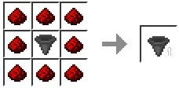

# Elevators

### Crafting an elevator motor

Surround a regular hopper with 8 redstone dust in a crafting table:


Breaking an elevator with Telepathy \(Crazy Enchant\) will cause it to become a normal hopper.


### Creating a working elevator

1. Place the elevator motor
2. Place a block above the motor
3. Place another elevator motor at another y-level, but make sure it's at the same x and z
4. Place a block above the 2nd motor
5. All done, you've just created your very first elevator!


If you don't place a block above the elevator motor, it won't work


### Using an elevator

* To go **up**, stand on the block that's above the elevator motor, then **jump**
* To go **down**, do the same thing, except instead of jumping, **crouch**


You can use elevators to hide secret rooms in your base


