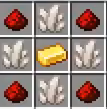
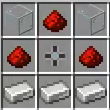

# Deep Storage Plugin

## What is it?
The Deep Storage plugin is a mod much like the popular mod **Applied Energistics**. It allows for mass storage in one single chest, along with allowing wireless access via the wireless control.

## Getting Started
First off, you'll need to get yourself quite a bit of the following materials: Quartz, Iron, Diamonds, Redstone, and Glass.

Next, you'll need to make a **Special Crafting** table. The recipe for it is below.

A little expensive, yes, I know, but it's worth it!
After you craft that, that'll be your new crafting table for all things **Deep Storage**.

The next thing you'll need to make is a **Deep Storage Loader**. The recipe is shown below.

Next, you'll want to get an **empty** double chest, and right-click the chest with the **Deep Storage Loader**.

Now, you need to make a **Storage Cell**. Storage cells are what power the chests to hold so many items. The base one holds 1,000 of the same item.
The recipe for it is shown below.

 **Storage Cells** can be upgraded, run `/crapi book` to see the recipes for the rest of the **Storage Cells**. 

Now, you have to make a container for your **Storage Cell**. The recipe for it is shown below.

 If you are wanting to craft a **Storage Container** for an upgraded **Storage Cell**, the recipe will be different, please regard `/crapi book` for the recipes involving larger **Storage Containers**. 

Great! Now you have a **Storage Container**.

The final step is to insert the **Storage Container** into the Deep Storage Unit(The chest you right-clicked with the **Deep Storage Loader**).

Your **Deep Storage Unit** should now look like this:

Congratulations, you have successfully created your first **Deep Storage Unit**!

## Extra Info regarding Storage Containers/Units
So, in each chest you can have a maximum of 5 **Storage Containers** regardless their size. Each storage container may only hold 7 different types of blocks, so for every double chest, you are limited to only having 34 different types of blocks.

Another thing to note is that you can transfer **Storage Containers** chest-to-chest, all data will sync in to chest once you place it inside.

Lastly, the **Deep Storage Units** do function with hoppers. When you open the unit, click the wrench item on the bottom-right, it will switch your ride-side menu to have two options, **Input** and **Output**. Simply click the block that you would like to output from the unit, and it will automatically start the transfer. One thing to note with hoppers attempting to place items **in** the unit is that the chest will only accept items that are in your **Storage Containers**. 

