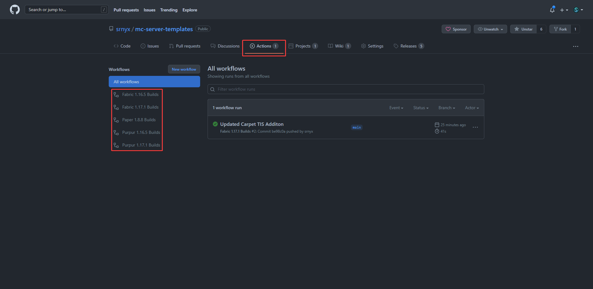
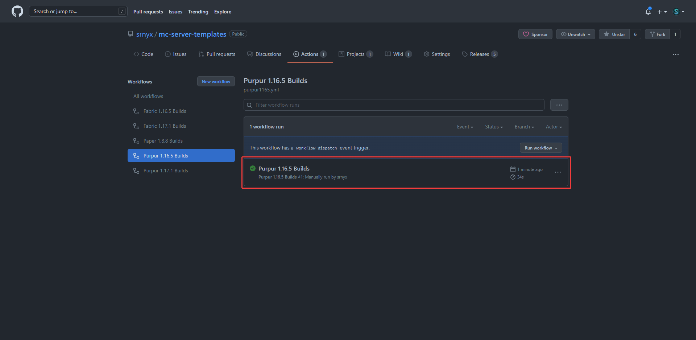
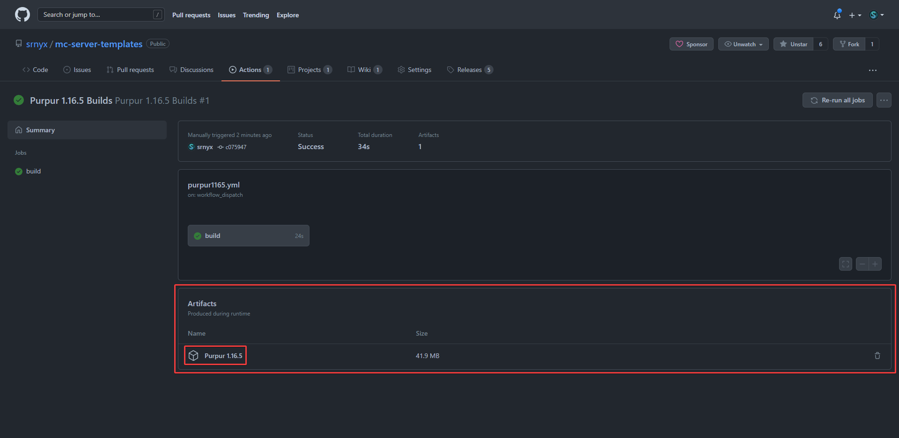

# Minecraft Templates

## Templates

#### Fabric

* [x] Fabric 1.16.5
* [x] Fabric 1.17.1
* [x] Fabric 1.18.2
* [x] Fabric 1.19.2

#### Paper

* [x] Paper 1.8.8

#### Purpur

* [x] Purpur 1.16.5
* [x] Purpur 1.17.1
* [x] Purpur 1.18.2
* [x] Purpur 1.19.2


I did not make any of the plugins, mods, or server software in the templates, please see [this page](broken-reference) for sources.


## Downloading the template

There are 2 ways/methods for downloading the template(s). The first one works for anyone, the second one requires you to be running a system that can run batch files (such as Windows).

### First Method

This first one makes use of the GitHub workflows/actions that I've set up:

1. Go to the [Actions page](https://github.com/srnyx/mc-server-templates/actions) on the GitHub
2. Click on the version you want to download from the left sidebar (ex: `Purpur 1.16.5 Builds`)
3. Click on the latest workflow run (the one at the top) and make sure it has a green circle (if it's orange/yellow, wait a bit. If it's red, [contact srnyx](https://srnyx.xyz/discord))
4. Scroll down to where it says `Artifacts`
5. Click on the artifact (ex: `Purpur 1.16.5`) to download it
6. Find the downloaded ZIP on your computer and extract the files
7. You're done! To learn how to start your server, read [Starting your server](./#starting-your-server)

 

 

 

<figure><figcaption></figcaption></figure>

### Second Method

This second method uses a custom batch script that I've created:

1. Download `mc-server-templates.bat` from [the repository](https://github.com/srnyx/mc-server-templates)
2. Run the file
3. Input software and version of the template you want when directed
4. You're done! To learn how to start your server, read [Starting your server](./#starting-your-server)


If you need help, please join my [Discord server](https://srnyx.xyz/discord) and open a ticket via #support.


## Starting your server

1. Open the server's folder
2. Run `start.bat`
3. The server will _not_ start because you need to accept the EULA
4. Open the `eula.txt` file in the server's folder and change `eula=false` to `eula=true`
5. Now, when you run `start.bat`, your server should start (if it doesn't join [my Discord server](https://srnyx.xyz/discord) and open a ticket via #support)


You MUST accept the EULA to use your server. Please read through it carefully.

